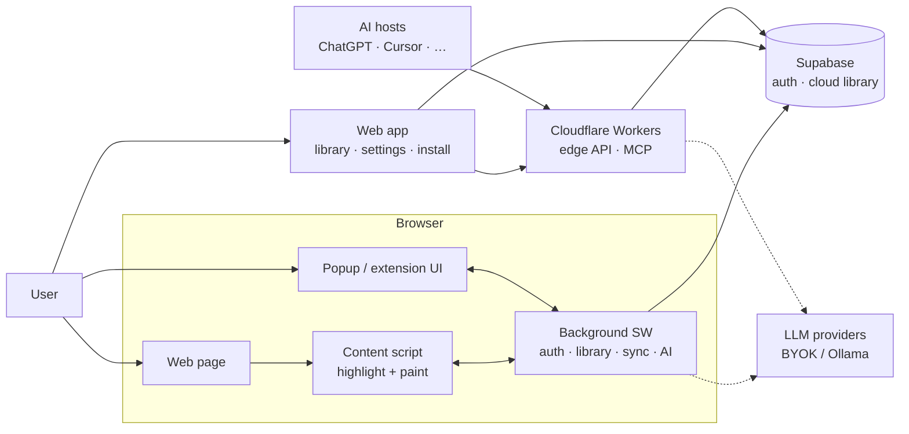

# Underscore Highlighter

**Highlight the web. Save passages to a library you can search, export, and sync.**

Browser extension (Chrome + Firefox, Manifest V3) and companion web app.

| | |
|---|---|
| **Version** | 0.1.3 |
| **License** | [GPL-3.0-only](./LICENSE) |
| **Privacy** | [PRIVACY.md](./PRIVACY.md) |
| **Docs index** | [docs/README.md](./docs/README.md) |

---

## What it does

Underscore lets you highlight text on any page and keep those passages in a
searchable library — on-device as a guest, or synced when you sign in.

| Mode | Who | Persistence |
|------|-----|-------------|
| **Guest** | No account | Permanent on this device |
| **Account (Free)** | Signed in | Synced across devices |
| **Account (Paid)** | Signed in + plan | Sync, Integrations (MCP), in-app chat (BYOK) |

AI features use your own keys or agents — Underscore does not bill model tokens.

---

## Architecture at a glance



| Piece | Role |
|-------|------|
| **Content script** | Capture and paint highlights on the page |
| **Background SW** | Auth, local library, cloud sync, IPC hub |
| **Web app** | Searchable library, install, account settings |
| **Supabase** | Identity + cloud source of truth when signed in |
| **Workers / MCP** | Edge API and agent access to **synced** library |

Guest data stays on-device. Signed-in library syncs to the cloud. Agents only see
synced data via Cloud MCP.

Deeper C4 view and flows:
[docs/01-development/system-architecture.md](./docs/01-development/system-architecture.md).

---

## Try it

### From a release zip

1. Download a build from the web app install page, or use artifacts under
   `public-web/downloads/` after `npm run zip:chrome` / `npm run zip:firefox`.
2. **Chrome**: `chrome://extensions` → Developer mode → Load unpacked → select
   the unzipped extension directory (or packed `.zip` where supported).
3. **Firefox**: temporary add-on via `about:debugging`, or follow
   [Firefox / AMO notes](./docs/01-development/firefox-amo-publish.md).

### From source (extension)

```bash
git clone git@github.com:sandeepsingh61935/_underscore.git
cd _underscore
npm install
npm run dev
```

WXT prints the extension output path (typically under `.output/`). Load that
directory as an unpacked extension in Chrome or Firefox.

### From source (web app)

```bash
npm run dev:web
```

Requires env vars (see [Configuration](#configuration)). Deploy path:
[Web CI/CD](./docs/01-development/web-ci-cd-deploy.md).

---

## Repository layout

```
_underscore/
├── src/
│   ├── entrypoints/       # WXT entrypoints (background, content, popup)
│   ├── content/           # Content-script highlight runtime
│   ├── background/        # Service worker services
│   ├── features/          # Feature modules (modes, vault, settings, oauth, …)
│   ├── ui-system/         # Design system, primitives, theme
│   ├── shared/            # Types, schemas, DI, platform-agnostic services
│   ├── pages/             # Extension page-level views
│   └── web/               # Web app (pages, API workers, app shell)
├── packages/              # Workspace packages (e.g. MCP server)
├── tests/                 # Unit / integration / e2e helpers
├── docs/                  # Policies, ADRs, security, specs, plans
├── store/                 # Store listing copy and screenshots
├── ui_kits/               # Wireframe / design references (V2 Editorial)
├── supabase/              # Schema and migrations
├── public/                # Extension static assets
└── public-web/            # Web static assets and download zips
```

Architecture truth, in order: **codebase** → [`docs/04-adrs/`](./docs/04-adrs/) →
[`docs/superpowers/specs/`](./docs/superpowers/specs/). Start at
[`docs/README.md`](./docs/README.md).

---

## Stack

- **Extension**: WXT, React 19, TypeScript (strict), Chrome/Firefox MV3
- **Web**: Vite SPA, Cloudflare Pages + Workers
- **Backend**: Supabase (auth, data), event-sourced sync
- **UI**: CSS custom properties (V2 Editorial) — no Tailwind
- **Quality**: ESLint, Prettier, Vitest, Playwright

---

## Development

### Prerequisites

- Node.js >= 20
- npm >= 10

### Common scripts

| Script | Purpose |
|--------|---------|
| `npm run dev` | Extension dev (WXT) |
| `npm run dev:web` | Web app dev server |
| `npm run build` | Production extension zips (all targets) |
| `npm run zip:chrome` / `zip:firefox` | Browser-specific packages |
| `npm run type-check` | TypeScript |
| `npm run lint` / `lint:fix` | ESLint |
| `npm run format` / `format:check` | Prettier |
| `npm test` | Unit tests (Vitest) |
| `npm run test:coverage` | Coverage report |
| `npm run test:e2e` | Playwright e2e |
| `npm run quality` | type-check + lint + format + unit tests + legacy-DS check |

### Configuration

Copy and fill environment files for local web/extension builds that talk to
backend services (never commit secrets):

- `.env.development` — local dev
- `.env.production` / `.env.production.example` — production web / CI

Typical variables include `VITE_SUPABASE_URL`, `VITE_SUPABASE_ANON_KEY`,
`VITE_WEB_APP_URL`, `VITE_MCP_CLOUD_URL`, and OAuth client IDs. See
[authentication architecture](./docs/01-development/authentication-architecture.md)
and [web deploy](./docs/01-development/web-ci-cd-deploy.md).

### Tests and quality bar

- Unit/integration: Vitest — target >= 80% overall coverage on services and
  repositories
- E2E: Playwright for critical flows
- Before merge: `npm run quality`

Details: [Quality framework](./docs/05-quality-framework/README.md).

---

## Documentation map

| Need | Location |
|------|----------|
| Doc routing / SSOT | [docs/README.md](./docs/README.md) |
| System architecture (C4) | [docs/01-development/system-architecture.md](./docs/01-development/system-architecture.md) |
| ADRs | [docs/04-adrs/](./docs/04-adrs/) |
| Feature specs | [docs/superpowers/specs/](./docs/superpowers/specs/) |
| Implementation plans | [docs/superpowers/plans/](./docs/superpowers/plans/) |
| Coding / testing standards | [docs/05-quality-framework/](./docs/05-quality-framework/) |
| Security / threat model | [docs/06-security/](./docs/06-security/) |
| Policies (commits, etc.) | [docs/00-policies/](./docs/00-policies/) |
| Dev runbooks | [docs/01-development/](./docs/01-development/) |
| Privacy policy | [PRIVACY.md](./PRIVACY.md) |
| Changelog | [CHANGELOG.md](./CHANGELOG.md) |
| Contributing | [CONTRIBUTING.md](./CONTRIBUTING.md) |

Agent/editor project rules live in [`CLAUDE.md`](./CLAUDE.md) (file map, UI
contracts, backend rules). They are not a substitute for `docs/`.

---

## Contributing

1. Read [CONTRIBUTING.md](./CONTRIBUTING.md) and the
   [quality framework](./docs/05-quality-framework/README.md).
2. Use conventional commits (`feat|fix|docs|…`) — see
   [git commit strategy](./docs/01-development/git-commit-strategy.md).
3. One logical change per commit; no emoji in commits or source.
4. Add tests for behavior changes; run `npm run quality` before opening a PR.

Security-sensitive findings: prefer a private report to the maintainer rather
than a public issue when exploit detail is involved. Threat model and controls:
[docs/06-security/](./docs/06-security/).

---

## License

[GNU General Public License v3.0 only](./LICENSE) (`GPL-3.0-only`).

---

## Author

Sandeep Singh — [github.com/sandeepsingh61935](https://github.com/sandeepsingh61935)
