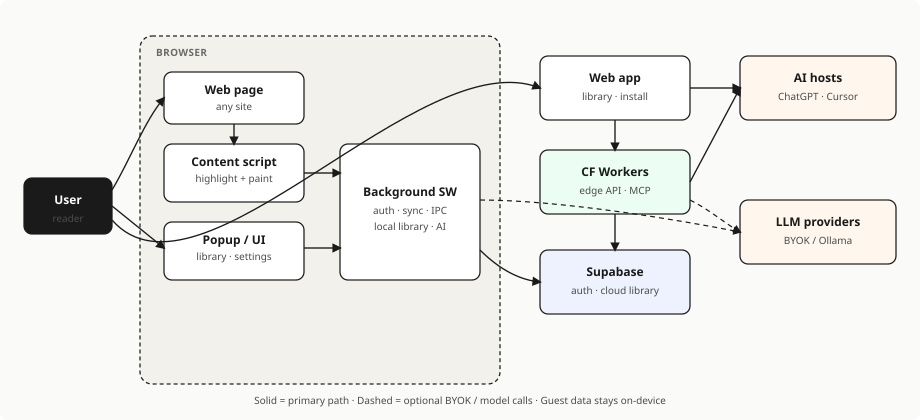

# Underscore Highlighter

**Highlight the web. Save passages to a library you can search, export, and
sync.**

Browser extension (**Chrome** + **Firefox**, Manifest V3) and companion **web
app**.

[](./LICENSE)
[](./package.json)
[](./package.json)
[](https://github.com/sandeepsingh61935/_underscore/actions/workflows/quality.yml)

|                  |                                                                                                                      |
| ---------------- | -------------------------------------------------------------------------------------------------------------------- |
| **Web app**      | [underscore-web-3i0.pages.dev](https://underscore-web-3i0.pages.dev)                                                 |
| **Privacy**      | [PRIVACY.md](./PRIVACY.md) · [hosted /privacy](https://underscore-web-3i0.pages.dev/privacy)                         |
| **License**      | [GPL-3.0-only](./LICENSE)                                                                                            |
| **Docs**         | [docs/README.md](./docs/README.md)                                                                                   |
| **Architecture** | [C4 overview](./docs/01-development/system-architecture.md) · [diagram SVG](./docs/assets/architecture-overview.svg) |

---

## What it does

Capture text on any page into a searchable library. Use it signed out on one
device, or sign in to sync. Paid unlocks Integrations (Cloud MCP) and in-app
chat with **your** models (BYOK / Ollama) — Underscore does not sell tokens.

| Mode               | Who              | What you get                                      |
| ------------------ | ---------------- | ------------------------------------------------- |
| **Guest**          | No account       | Permanent highlights on this device only          |
| **Account (Free)** | Signed in        | Cloud library sync across devices                 |
| **Account (Paid)** | Signed in + plan | Sync + Cloud MCP integrations + in-app Ask (BYOK) |

**Product rules (short):** guest data never goes to the cloud; agents only see
**synced** library rows via Cloud MCP
([ADR-029](./docs/04-adrs/029-cloud-first-library-and-integrations.md)).

---

## Architecture at a glance

<p align="center">
  <a href="./docs/assets/architecture-overview.svg">
    
  </a>
</p>

<p align="center">
  <sub>
    Scales with the page ·
    <a href="./docs/assets/architecture-overview.svg">Open SVG</a> ·
    <a href="./docs/01-development/system-architecture.md">Full architecture</a>
  </sub>
</p>

| Piece                    | Role                                                           |
| ------------------------ | -------------------------------------------------------------- |
| **Content script**       | Selection, highlight paint, mode behavior on the page          |
| **Background SW**        | Auth, repositories, sync, IPC, billing hooks, AI orchestration |
| **Popup / extension UI** | Dashboard, library, settings (React, V2 Editorial)             |
| **Web app**              | Library, install onboarding, account, OAuth consent            |
| **Supabase**             | Auth + cloud source of truth (RLS) when signed in              |
| **Cloudflare Workers**   | Edge API, LLM proxy, **Cloud MCP**                             |
| **Local stores**         | IndexedDB scopes (`basic` / `pro`) + `chrome.storage`          |

```text
Page → Content script ⇄ Background SW → IndexedDB
                         ↓
                   Supabase (signed-in)
                         ↑
User → Web app ⇄ Workers / MCP → AI hosts (optional)
```

---

## Try it

### Web

Open the app:
[https://underscore-web-3i0.pages.dev](https://underscore-web-3i0.pages.dev)

Use **/install** for browser-specific sideload steps when distribution is
manual.

### Extension from zip (v0.1.3)

Prebuilt archives (also produced by `bun run zip:chrome` / `zip:firefox`):

- [`public-web/downloads/underscore-highlighter-0.1.3-chrome.zip`](./public-web/downloads/underscore-highlighter-0.1.3-chrome.zip)
- [`public-web/downloads/underscore-highlighter-0.1.3-firefox.zip`](./public-web/downloads/underscore-highlighter-0.1.3-firefox.zip)

1. **Chrome / Chromium:** `chrome://extensions` → Developer mode → **Load
   unpacked** (unzip first) or install the packaged build as your browser
   allows.
2. **Firefox:** temporary add-on via `about:debugging`, or follow
   [AMO publish notes](./docs/01-development/firefox-amo-publish.md).

### From source

```bash
git clone git@github.com:sandeepsingh61935/_underscore.git
cd _underscore
bun install

# Extension (WXT) — load the printed .output path as unpacked
bun run dev

# Web app (Vite) — needs env; see Configuration
bun run dev:web
```

---

## Stack

| Layer     | Choices                                                              |
| --------- | -------------------------------------------------------------------- |
| Extension | WXT, React 19, TypeScript strict, MV3 (Chrome + Firefox)             |
| Web       | Vite SPA → **Cloudflare Pages** (primary) and **Vercel** (CI mirror) |
| API / MCP | Cloudflare Workers, `packages/mcp-server`                            |
| Data      | Supabase (Auth, Postgres, Realtime, RLS), event-sourced sync         |
| UI        | CSS custom properties **V2 Editorial** (no Tailwind)                 |
| Quality   | ESLint, Prettier, Vitest, Playwright, GitHub Actions                 |

---

## Repository layout

```text
_underscore/
├── src/
│   ├── entrypoints/     # background, content, popup (WXT)
│   ├── content/         # in-page highlight runtime + modes
│   ├── background/      # SW services, auth, sync, repos
│   ├── features/        # product features (auth, library, billing, MCP, …)
│   ├── ui-system/       # design system + theme tokens
│   ├── shared/          # schemas, DI, repositories, platform-agnostic code
│   ├── pages/           # extension full-page views
│   └── web/             # web SPA + edge-facing pieces
├── packages/mcp-server  # Cloud MCP server package
├── supabase/            # migrations / schema
├── docs/                # SSOT index, ADRs, security, specs, plans
│   └── assets/          # diagrams (e.g. architecture-overview.svg)
├── store/               # AMO/CWS listing copy + screenshots
├── ui_kits/             # V2 wireframe reference
├── public/              # extension static assets
├── public-web/          # web static + download zips
└── .github/workflows/   # quality.yml, deploy-web.yml
```

**Architecture authority:** code → [ADRs](./docs/04-adrs/) →
[specs](./docs/superpowers/specs/) →
[C4 orientation doc](./docs/01-development/system-architecture.md).  
Start at [docs/README.md](./docs/README.md).

---

## Development

### Prerequisites

- Bun >= 1.4.0 (primary package manager & script runner)
- Node.js >= 20 (runtime fallback for Playwright browser drivers)

### Scripts

| Script                               | Purpose                                                  |
| ------------------------------------ | -------------------------------------------------------- |
| `bun run dev`                        | Extension dev server (WXT with live reload)              |
| `bun run dev:web`                    | Web app dev server                                       |
| `bun run build`                      | Build Chrome extension (`.output/chrome-mv3`)            |
| `bun run build:all` / `zip:all`      | Production extension packages (Chrome + Firefox zips)    |
| `bun run zip:chrome` / `zip:firefox` | Per-browser zips + download sync                         |
| `bun run web:build`                  | Production web bundle (`dist-web`)                       |
| `bun run web:deploy`                 | Build + deploy Cloudflare Pages                          |
| `bun run web:deploy:vercel`          | Deploy web to Vercel                                     |
| `bun run mcp:dev` / `mcp:build`      | MCP package (native Bun TS execution)                    |
| `bun run type-check`                 | TypeScript                                               |
| `bun run lint` / `lint:fix`          | ESLint                                                   |
| `bun run format` / `format:check`    | Prettier                                                 |
| `bun test` / `test:coverage`         | Vitest                                                   |
| `bun run test:e2e`                   | Playwright                                               |
| `bun run quality`                    | type-check + lint + format + unit tests + legacy-DS gate |

CI:
[Quality Checks](https://github.com/sandeepsingh61935/_underscore/actions/workflows/quality.yml)
on `main`/`dev` and PRs;
[Deploy Web](https://github.com/sandeepsingh61935/_underscore/actions/workflows/deploy-web.yml)
on `main` (Cloudflare + Vercel).

### Configuration

Do not commit secrets. Use:

- `.env.development` — local extension/web
- `.env.production` / [`.env.production.example`](./.env.production.example) —
  production builds
- GitHub Actions secrets — see
  [web CI/CD](./docs/01-development/web-ci-cd-deploy.md)

Common vars: `VITE_SUPABASE_URL`, `VITE_SUPABASE_ANON_KEY`, `VITE_WEB_APP_URL`,
`VITE_MCP_CLOUD_URL`, `VITE_GOOGLE_CLIENT_ID`.

Auth deep-dive:
[authentication-architecture.md](./docs/01-development/authentication-architecture.md).

### Quality bar

- Vitest for unit/integration (target >= 80% on services/repositories)
- Playwright for critical e2e flows
- Run `bun run quality` before merge

---

## Documentation map

| Need                       | Location                                                                                   |
| -------------------------- | ------------------------------------------------------------------------------------------ |
| Doc routing / SSOT         | [docs/README.md](./docs/README.md)                                                         |
| System architecture (C4)   | [docs/01-development/system-architecture.md](./docs/01-development/system-architecture.md) |
| Architecture diagram (SVG) | [docs/assets/architecture-overview.svg](./docs/assets/architecture-overview.svg)           |
| ADRs                       | [docs/04-adrs/](./docs/04-adrs/)                                                           |
| Feature specs              | [docs/superpowers/specs/](./docs/superpowers/specs/)                                       |
| Plans                      | [docs/superpowers/plans/](./docs/superpowers/plans/)                                       |
| Quality framework          | [docs/05-quality-framework/](./docs/05-quality-framework/)                                 |
| Security                   | [docs/06-security/](./docs/06-security/)                                                   |
| Policies                   | [docs/00-policies/](./docs/00-policies/)                                                   |
| Dev runbooks               | [docs/01-development/](./docs/01-development/)                                             |
| Store listing              | [store/amo/](./store/amo/)                                                                 |
| Privacy                    | [PRIVACY.md](./PRIVACY.md)                                                                 |
| Changelog                  | [CHANGELOG.md](./CHANGELOG.md)                                                             |
| Contributing               | [CONTRIBUTING.md](./CONTRIBUTING.md)                                                       |

Editor/agent conventions: [`CLAUDE.md`](./CLAUDE.md) (supports docs; does not
replace them).

---

## Contributing

1. Read [CONTRIBUTING.md](./CONTRIBUTING.md) and the
   [quality framework](./docs/05-quality-framework/README.md).
2. Conventional commits —
   [git commit strategy](./docs/01-development/git-commit-strategy.md).
3. One logical change per commit; no emoji in commits or source.
4. Tests for behavior changes; `bun run quality` before PR.

Security-sensitive reports: contact the maintainer privately when exploit detail
is involved. See [docs/06-security/](./docs/06-security/).

---

## License

[GNU General Public License v3.0 only](./LICENSE) (`GPL-3.0-only`).

---

## Maintainer

Sandeep Singh ([sandeepsingh61935](https://github.com/sandeepsingh61935))  
Privacy: [privacy@underscore.dev](mailto:privacy@underscore.dev)
