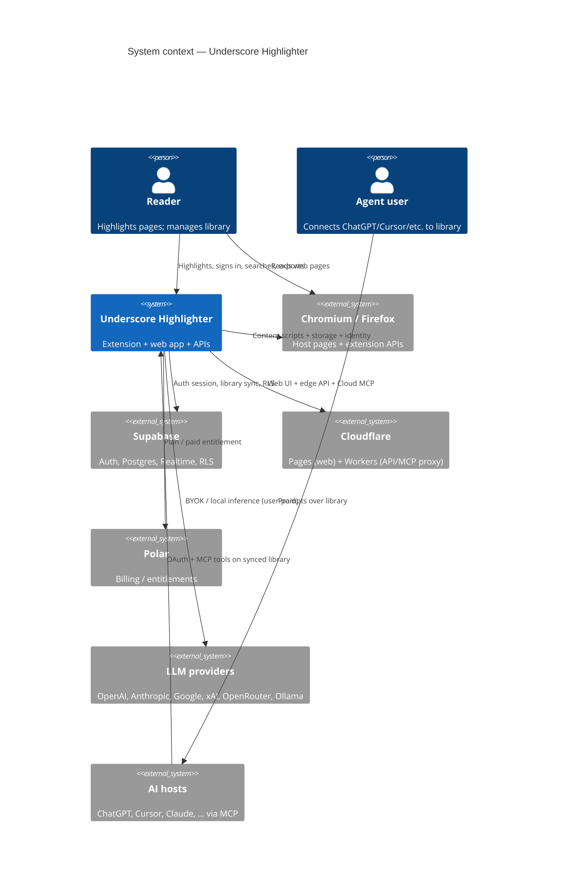
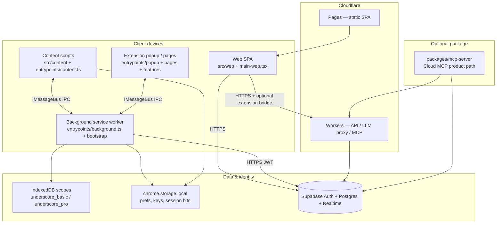
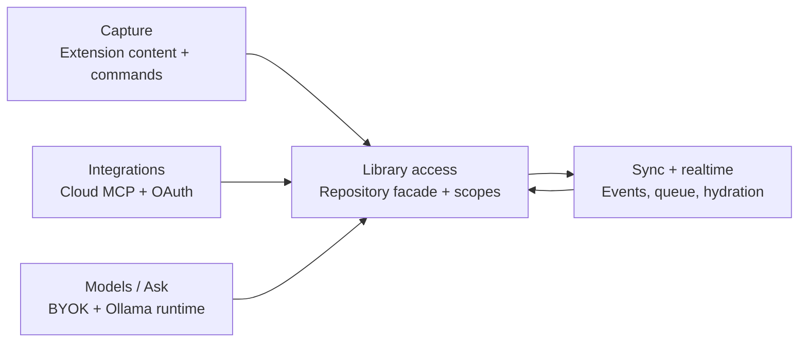
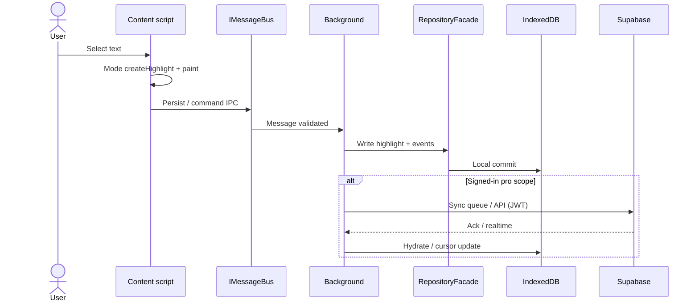
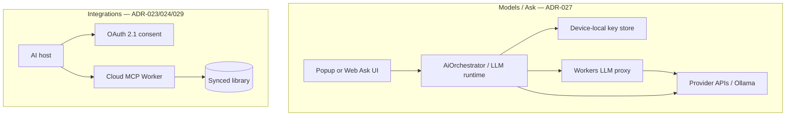
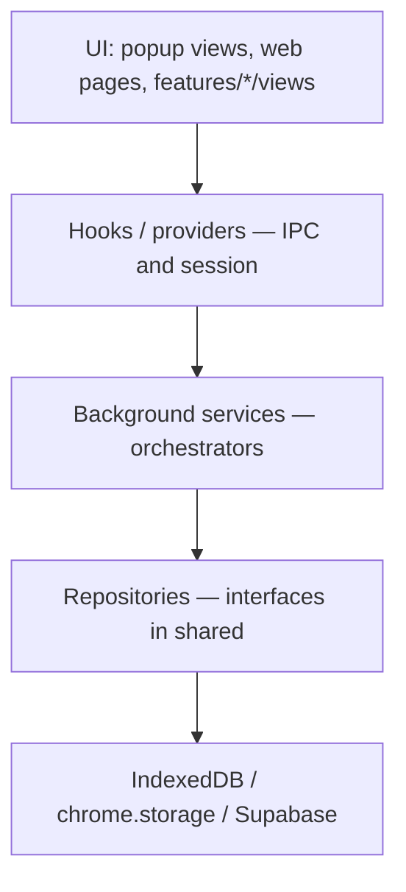
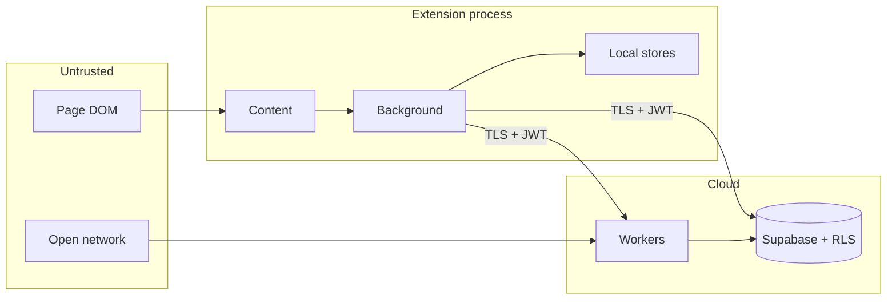

# System Architecture (C4 Overview)

**Status**: Living orientation doc — not a second source of truth  
**Audience**: Engineers onboarding or changing cross-cutting behavior  
**Last aligned to codebase**: 2026-08-31  

| Authority order (on conflict, higher wins) | |
|---|---|
| 1 | Code under `src/`, `packages/`, `supabase/` |
| 2 | Accepted ADRs in [`docs/04-adrs/`](../04-adrs/) |
| 3 | Feature specs in [`docs/superpowers/specs/`](../superpowers/specs/) |
| 4 | This document (orientation only) |

> **Why this exists:** Industry practice (C4 model) keeps a thin *context + containers*
> view so humans can navigate. This project deliberately does **not** maintain a
> monolithic encyclopedia of every class — those drift. Decisions live in ADRs;
> structure lives in code. Regenerate graph-backed call flows with graphify when
> you need component-level maps.

**Related**

- Docs index: [`docs/README.md`](../README.md)
- Security: [`docs/06-security/security-architecture.md`](../06-security/security-architecture.md)
- Threat model: [`docs/06-security/threat-model.md`](../06-security/threat-model.md)
- Agent file map / UI contracts: [`CLAUDE.md`](../../CLAUDE.md)
- Interactive call-flow (local): `npx`/`graphify` → `graphify-out/callflow.html` (gitignored)

---

## 1. System context (C4 Level 1)

**Underscore Highlighter** helps people capture passages from the web into a
searchable library — device-local as a guest, cloud-synced when signed in — and
optionally expose the **synced** library to external AI agents (Cloud MCP) and
in-app chat (BYOK).

If Mermaid C4 is unavailable in your viewer, the same relationships:

| Actor / system | Relationship |
|----------------|--------------|
| Reader | Uses extension on pages; optional web library/settings |
| Browser | Runs MV3 extension; enforces permissions and CSP |
| Supabase | Identity + durable cloud library (signed-in) |
| Cloudflare | Hosts SPA; Workers for edge API / MCP |
| Polar | Paid plan entitlement |
| LLM providers | User keys or local Ollama — not billed by Underscore |
| AI hosts | Cloud MCP reads **synced** library only (ADR-029) |

---

## 2. Containers (C4 Level 2)

Runtime deployables and major process boundaries.

### Container catalog

| Container | Tech | Responsibility | Trust notes |
|-----------|------|----------------|-------------|
| **Content scripts** | TS, DOM | Selection → highlight paint; mode behavior; page-local UX | Untrusted page DOM; sanitize; no raw secrets |
| **Background SW** | WXT MV3, DI container | Auth, repositories, sync, delete, billing hooks, AI orchestrator, IPC hub | Validates messages; owns privileged APIs |
| **Popup / extension pages** | React 19, V2 UI | Dashboard, mode, settings, auth surfaces | Chrome-only via hooks; no direct repo calls |
| **Web SPA** | Vite, React | Library, install, settings, OAuth consent, billing UI | Online-first library; JWT to Supabase/Workers |
| **Cloudflare Pages** | Static + Functions | Host web assets | Public origin pinned in extension `externally_connectable` |
| **Workers / edge API** | Hono-style workers | LLM proxy (ADR-027), MCP, server-side checks | Never trust client; validate JWT |
| **Supabase** | Auth, Postgres, Realtime, RLS | Cloud SoT for signed-in library; events/sync | RLS is mandatory (see security docs) |
| **IndexedDB (device)** | Per-mode DBs | Guest SoT; signed-in **cache** + offline | Guest never uploads (ADR-029) |
| **MCP server** | `packages/mcp-server` | Tool surface for agents on **synced** library | OAuth 2.1 / bearer; no guest data |

---

## 3. Product modules (logical)

Cross-cutting product seams (ADR-029), independent of UI shell:

| Module | Job | SoT rules |
|--------|-----|-----------|
| **Capture** | Create/update/delete highlights on pages | Writes go through mode + repository path |
| **Library access** | Read/write library with explicit scope | Guest = device only; Account = cloud SoT + device cache |
| **Sync** | Event-sourced offline-first sync | Append-only events; vector clocks / LWW (ADR-001, ADR-002) |
| **Integrations** | External agents | Synced cloud rows only; extension not required |
| **Models** | In-app AI | Keys device-local; prefs may sync without secrets |

---

## 4. Modes and capabilities

Internal IDs are stable contracts; display names are branding-only
(`src/shared/constants/mode-branding.ts`).

| Mode ID | UI name | Family | Persistence | Auth | AI / MCP |
|---------|---------|--------|-------------|------|----------|
| `basic` | Guest | device | Permanent on device (`underscore_basic`) | No | No |
| `pro` | Account (Free) | cloud | Cloud SoT + device cache (`underscore_pro`) | Yes | No (UI may show locked) |
| `pro_xai` | Account (Paid) | cloud | Same as `pro` | Yes | Yes (BYOK + Cloud MCP) |

`pro_xai` is a **capability overlay** on `pro` storage/sync — not a separate library
(ADR-025, ADR-029).

**ISP:** modes implement only the interfaces they need (ADR-003) via
`src/content/modes/*` and the mode registry in `src/features/modes/`.

---

## 5. Key runtime flows

### 5.1 Highlight capture (happy path)

**Code anchors**

- Content entry: `src/entrypoints/content.ts`
- Modes: `src/content/modes/`
- Background entry + IPC: `src/entrypoints/background.ts`
- DI bootstrap: `src/background/bootstrap.ts`
- Repositories: `src/background/repositories/`, `src/shared/repositories/`

### 5.2 Auth and session

- Extension: `AuthManager` in background; session in secure extension storage;
  broadcasts `AUTH_STATE_CHANGED` to UI/content.
- Web: `WebAuthProvider` + Supabase JS client (`src/shared/auth/`).
- External web origins allowed for auth bridge are pinned
  (`isAllowedExternalAuthOrigin`, `externally_connectable` in `wxt.config.ts`).

### 5.3 Library on web vs extension

| Surface | Typical access |
|---------|----------------|
| Extension popup / content | Local facade + hydration from cloud when signed in |
| Web library | Online-first Supabase (ADR-029); extension optional for install/presence |
| Cloud MCP | Supabase under user OAuth/JWT — **synced** data only |

### 5.4 AI and Integrations

- Bridge MCP path is **soft-deprecated** for product UI; cloud-first is canonical.
- Paid entitlement gates AI + MCP; library sync remains for account tier per ADR-029.

---

## 6. Extension layering and dependencies

Enforced direction of dependencies (do not layer-skip):

**Rules (project invariants)**

| Rule | Rationale |
|------|-----------|
| UI must not call repositories or Supabase clients directly for privileged paths | Testability; single policy point |
| Content must not assume background always alive without IPC timeouts | MV3 SW lifecycle |
| All cross-context messages use `IMessageBus` + schemas | ADR messaging contract; validate payloads |
| Workers/API validate JWT; never trust client claims | Security architecture |
| Guest data never enters cloud library pipelines | ADR-029 |
| No secrets in source; BYOK keys in extension sandbox storage | Security + store review |

Patterns in active use: **DI container**, **repository facade**, **event bus**,
**command stack** (undo), **event sourcing** for sync, **mode ISP**.

---

## 7. Component map (C4 Level 3 — selective)

Only hubs that repeatedly appear in change requests. For exhaustive graphs, open
`graphify-out/callflow.html` after a local graphify build.

| Area | Primary locations |
|------|-------------------|
| Background bootstrap / DI | `src/background/bootstrap.ts`, `src/background/di/` |
| Auth | `src/background/auth/`, `src/features/auth/` |
| Sync / events / realtime | `src/background/sync/`, `src/background/events/`, `src/background/realtime/` |
| Highlight delete / orchestrate | `src/background/services/*highlight*` |
| Cloud hydration / ingest | `cloud-hydration-service`, `realtime-highlight-ingest-service` |
| Content highlight pipeline | `selection-detector`, `highlight-manager`, `highlight-renderer`, `modes/` |
| Popup chrome | `PopupShell`, `src/entrypoints/popup/` — views are body-only |
| Web app shell | `src/web/pages`, `src/web/routing`, `src/web/api` |
| Shared contracts | `src/shared/schemas`, `src/shared/interfaces`, `src/shared/repositories` |
| Billing / caps | `src/features/billing`, `resolveWebCaps`, background billing handlers |
| MCP | `packages/mcp-server`, `src/features/settings/mcp`, OAuth consent views |

Community hubs observed in the knowledge graph (navigation aids, not ownership
boundaries): Highlight repository facade, Auth and cloud hydration, Sync queue and
EventBus, Mode state machine, Cloud MCP Worker, Web LLM stream proxy, Popup app
shell, Content script highlights.

---

## 8. Data and trust boundaries

| Boundary | Control |
|----------|---------|
| Page → content | Minimal DOM read; paint overlays; no eval; CSP |
| Content → background | Schema-validated IPC |
| Extension → Supabase | Anon key + user JWT; RLS |
| Web → Workers | Origin + JWT; rate limits |
| Agent → MCP | OAuth/bearer; entitlement; synced library only |
| HTML from user/web | DOMPurify on render paths |

Details: [`docs/06-security/`](../06-security/).

---

## 9. Deployment topology

| Artifact | Pipeline / command | Target |
|----------|-------------------|--------|
| Chrome extension | `npm run zip:chrome` | Chromium load / CWS packaging |
| Firefox extension | `npm run zip:firefox` | AMO (`docs/01-development/firefox-amo-publish.md`) |
| Web SPA | `npm run web:build` / `web:deploy` | Cloudflare Pages |
| MCP / workers | Wrangler + `packages/mcp-server` | Cloudflare Workers |
| Schema | `supabase` migrations | Supabase project |

Env templates: `.env.development`, `.env.production.example`  
Runbook: [`web-ci-cd-deploy.md`](./web-ci-cd-deploy.md)

---

## 10. Quality and evolution

| Practice | Where |
|----------|-------|
| TypeScript strict, no casual `any` | `tsconfig`, quality scripts |
| Unit: Vitest; E2E: Playwright | `npm test`, `npm run test:e2e` |
| Gate | `npm run quality` |
| Architectural change | New ADR in `docs/04-adrs/` (do not silently rewrite history) |
| Feature design | Dated spec under `docs/superpowers/specs/` |
| Graph refresh after large moves | `graphify update .` then open `graphify-out/callflow.html` |

---

## 11. ADR index (architecture-relevant)

| ADR | Topic |
|-----|--------|
| [001](../04-adrs/001-event-sourcing-for-sync.md) | Event sourcing for sync |
| [002](../04-adrs/002-event-driven-architecture.md) | Event-driven architecture |
| [003](../04-adrs/003-interface-segregation-multi-mode.md) | Mode ISP |
| [019](../04-adrs/019-rate-limiting-strategy.md) | Rate limiting |
| [020](../04-adrs/020-idataprovider-decision.md) | Data provider |
| [023](../04-adrs/023-mcp-server-architecture.md) | MCP server |
| [024](../04-adrs/024-mcp-cloud-oauth.md) | Cloud MCP OAuth |
| [025](../04-adrs/025-mode-feature-boundaries.md) | Mode capability matrix |
| [027](../04-adrs/027-platform-independent-llm-runtime.md) | LLM runtime / web pass-through |
| [028](../04-adrs/028-grounded-chat-persistence.md) | Grounded chat persistence |
| [029](../04-adrs/029-cloud-first-library-and-integrations.md) | Cloud-first library + integrations |

Older mode names (Walk/Sprint/Vault/Gen) appear in early ADRs; **runtime v3** is
`basic` | `pro` | `pro_xai` as above.

---

## 12. How to maintain this doc

**Update this file when:**

- A new container appears (e.g. native app, new edge service)
- SoT rules or trust boundaries change
- A mode or major module is added/removed

**Do not:**

- List every React component or duplicate ADR text
- Put secrets, env values, or infrastructure account IDs here
- Create `architecture_v2.md` — edit in place; history is git

**Prefer instead:**

- ADR for a decision
- Spec for a feature
- Graphify call-flow for navigable code-level diagrams
