# Hover Delete Icon - Architecture Flow

## System Overview

## The Critical Bug

## Data Flow - 3 Storage Layers

## Current System State

| Component                  | Status         | Count                                          |
| -------------------------- | -------------- | ---------------------------------------------- |
| **CSS.highlights**         | ✅ Working     | 7 entries (both `hl-*` and `underscore-*`)     |
| **Mode.data**              | ✅ Working     | Same count as CSS                              |
| **RepositoryFacade.cache** | ❌ **BROKEN**  | **0 entries**                                  |
| **chrome.storage.local**   | ✅ Working     | Restored on reload                             |
| **Hover Detector**         | ❌ Blocked     | Can't find highlights (reads from empty cache) |
| **Delete Icon**            | ❌ Never shown | Hover detector never fires events              |

## Root Cause Hypothesis

**Problem**: `repository.add()` is called but `cache` remains empty

**Possible Causes**:

1. **Different instance**: Hover detector uses different `repositoryFacade`
   instance?
2. **Cache cleared**: Something clears cache after initialization?
3. **Restore bug**: Highlights restored to CSS/Mode but NOT to repository cache?
4. **Async race**: Cache.set() happens but then gets wiped?

## Next Debugging Steps

## Expected Flow After Fix

```mermaid
sequenceDiagram
    participant User
    participant Mouse
    participant HoverDetector
    participant Repository
    participant CSS
    participant DeleteIcon

    User->>Mouse: Move over highlight
    Mouse->>HoverDetector: mousemove event
    HoverDetector->>Repository: getAll()
    Repository-->>HoverDetector: [highlight1, highlight2, ...]
    HoverDetector->>CSS: highlights.get("underscore-id")
    CSS-->>HoverDetector: Highlight with Ranges
    HoverDetector->>HoverDetector: Check point in rects
    HoverDetector->>DeleteIcon: emit("highlight:hover:start", {id, rect})
    DeleteIcon->>DeleteIcon: showIcon(id, rect)
    DeleteIcon->>User: 🗑️ Icon appears!
```

