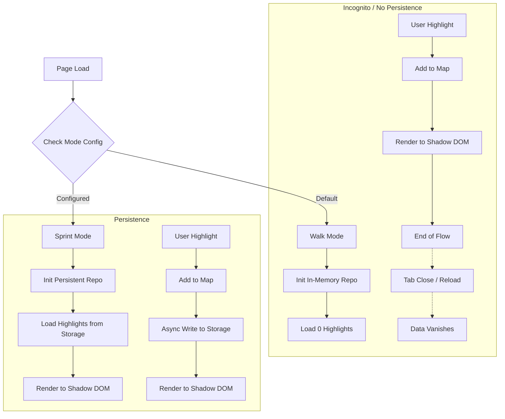

# IMPL PLAN: Walk Mode (Default No-Persistence)

# Goal Description

Implement **Walk Mode** as the default behavior for the extension. Walk Mode
provides "True Incognito" highlighting where data is purely in-memory, exists
only for the lifetime of the tab/session, and has **zero persistence**
side-effects (no LocalStorage, no IndexedDB, no Network).

This addresses critical performance issues observed in the current "Sprint Mode"
(which had evolved to be persistent) and aligns with the user's desire for a
privacy-first, lightweight default.

## User Review Required

> [!IMPORTANT] **Breaking Change**: The default mode will switch to **Walk
> Mode**. Existing "Sprint Mode" highlights that were previously persisted will
> NOT be automatically loaded in Walk Mode. Users must explicitly switch to
> "Sprint Mode" (or "Project Mode" in future naming) to see persisted
> highlights.

> [!NOTE] The requested "Whitelist" feature for persistence has been deferred to
> a future task to focus on stabilizing the core architecture first.

## Flowchart: Mode Logic

## Proposed Changes

### 1. `src/shared/repositories/repository-factory.ts`

Refactor to support mode switching.

#### [MODIFY] `repository-factory.ts`

- Add `setMode(mode: 'walk' | 'sprint')` method (or similar config injection).
- In `walk` mode, ensure `InMemoryHighlightRepository` is returned and **is not
  wrapped** with any persistence decorators (if any exist later), or simply
  relies on the fact that `InMemoryHighlightRepository` is purely ephemeral.
- _Note:_ Currently `InMemoryHighlightRepository` is already ephemeral. The
  issue is likely in `SprintMode` class adding extra persistence calls.

### 2. `src/content/modes/sprint-mode.ts` -> Rename/Refactor

The current `SprintMode` class mixes in persistence logic. We need to separate
"Mode Behavior" from "Persistence Strategy".

#### [NEW] `src/content/modes/walk-mode.ts`

- A pure implementation that extends `BaseHighlightMode`.
- `createHighlight`: Adds to internal map and `CSS.highlights`. **NO** calls to
  `storage.saveEvent` or `repository.add` if those imply persistence.
- `restore`: Empty method (nothing to restore).

#### [MODIFY] `src/content/modes/sprint-mode.ts`

- Explicitly mark this as the _Persistent_ mode.
- Keep the existing logic that calls `this.repository.add` (which we might
  eventually back with IndexedDB).

### 3. `src/content/content-script.ts` (or Entry Point)

#### [MODIFY] `main.ts` / Entry Point

- Change default instantiation from `SprintMode` to `WalkMode`.
- Add logic to check user config to see if they _opted in_ to persistence
  (future hook).

### 4. `src/shared/repositories/in-memory-highlight-repository.ts`

#### [MODIFY]

- Ensure it remains purely in-memory. (No changes needed, verified).

## Verification Plan

### Automated Tests

- **Unit Test (`walk-mode.test.ts`)**:
  - Create a highlight.
  - Verify it exists in `CSS.highlights` and internal map.
  - Verify `restore()` does nothing.
- **Integration Test**:
  - Simulate a "Reload" by instantiating a new `WalkMode` instance.
  - Verify it starts empty even if the previous instance had data (since it
    shares nothing).

### Manual Verification

1.  **Open Extension**: Ensure it loads without error.
2.  **Highlight**: Select text and double-click. Verify highlight appears.
3.  **Reload Page**: Refresh the tab. Verify highlight **disappears**.
4.  **Performance**: Rapidly reload the page. Verify no "Wait" or "Slow"
    warnings occur.
5.  **Check Storage**: Open DevTools -> Application -> Local Storage. Verify no
    new keys were added during Walk Mode usage.
