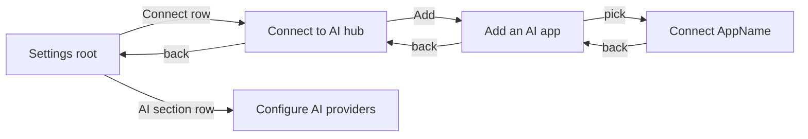

# Spec + Plan: Connect to AI hub (post-grilling)

**Date:** 2026-07-14  
**Source:** Cursor session `PR2 Connect to AI hub` (`9b0eca93-ef10-4373-a98d-9ef79f73980a`)  
**Status:** Phase 0 + core PR2 hub shipped; **Settings IA simplify (PR-S1) implemented**  
**Canvases (visual source of truth):**
- `~/.cursor/.../canvases/mcp-connections-mockup.canvas.tsx` — Option B hub/picker/setup
- `~/.cursor/.../canvases/settings-ai-simplify.canvas.tsx` — simplified Settings AI section (latest LGTM direction)
**Wireframe (repo):** `ui_kits/extension/v2/screens-mcp-connections.jsx`  
**Internal mode IDs (unchanged):** `basic` | `pro` | `pro_xai`

---

## Context

Users struggled to set up MCP: dense banners, missing setup guidance, unclear boundary between **external agent MCP** and **in-app model providers**, and awkward Settings IA (duplicate “Configure AI providers”, status glyphs that meant nothing).

Grilling locked a product model, a status-first hub (Option B), tier naming/gating, navigation stack, and a final Settings simplify pass. This document is the single locked spec for finishing work — do not reopen decisions unless product intent changes.

---

## Product boundary (MCP vs providers)

| Surface | Job | Who pays inference |
|---------|-----|--------------------|
| **Connect to AI** | Let external agents/MCP hosts read the user’s highlight library | User’s agent (Cursor, Claude, etc.) |
| **Configure AI providers** | Models for **in-app / popup chat** | User’s API keys / free OpenRouter path |

- Not the same feature. Do not merge into one picker.
- Paid pitch is cost-honest: *“connect your library to the AI you already use”* — _underscore does not sell tokens.

---

## Locked decisions (all grilling rounds)

### A. Tiers & naming

| Internal ID | Display name | Free/Paid badge |
|-------------|--------------|-----------------|
| `basic` | **Guest** | none |
| `pro` | **Account (Free)** | **Free** Pill when signed in |
| `pro_xai` | **Account (Paid)** | **Paid** Pill when signed in |

- Names live in `MODE_BRANDING` / `mode-constants` — display only; no storage/IPC rename.
- ModeSelector uses full branding names (not Basic/Pro/10x-Pro hardcodes).
- Until billing ships: Account (Paid) remains **selectable via ModeSelector** for signed-in users (manual claim).

### B. Capability gating

| Decision | Value |
|----------|--------|
| Capability | Declarative **`mcp`** on mode matrix + **`canUseMcp()`** (not reused `ai` forever) |
| Who has MCP | **`pro_xai` only** |
| In-app AI chat / providers | Paid (`ai` capability) — same tier today, separate flag |
| Enforcement | **Hard gate UI + background bridge** (`enforceBridgeEligibility` / bridge handler) |
| Grandfather Free bridge | **No** — hard cutover |
| Guest locked CTA | **Sign in to continue** |
| Free locked CTA | **Upgrade · Coming soon** (no fake checkout) |
| Locked feature map | **Visible but locked** — not collapsed into a mystery card |
| Tap locked row | Opens same CTA path **or** opens **locked hub** for Connect (preview feature map) |

### C. Connect to AI structure (Option B)

| # | Decision |
|---|----------|
| Structure | **Status-first hub** — not “On this Mac / In the cloud / Local models” groups |
| Enable | **One global toggle** “Let AI apps read highlights” + **one security code** |
| Security code | Shown on hub when On **and** repeated in setup step |
| Active list | Only after **Check connection / handshake succeeds** (not optimistic) |
| Add flow | Full-screen **Add an AI app** picker → **shared setup checklist**; path + snippet swap per app |
| Picker contents | **External MCP hosts only** — no OpenAI/Anthropic/Ollama/Models |
| Catalog size | **Flat 8** (no “top 10 searchable” sprawl; no Add-custom form) |
| Other | Generic snippet only (“Other MCP client”) |

**Picker order (locked):**

1. Claude Code  
2. Claude Desktop  
3. Codex  
4. ChatGPT Desktop  
5. Cursor  
6. Antigravity  
7. Gemini  
8. Other MCP client  

Snippets: JSON family (Claude/Cursor/etc.) vs TOML family (Codex / ChatGPT Desktop). ChatGPT Desktop = **local Codex host**, not ChatGPT web OAuth.

### D. Navigation chrome



- True **push/pop stack** — Setup back returns to **picker**, not always Hub.
- Header = **current page title**; back label is **contextual** (`← Settings` / `← Connect to AI` / `← Add an AI app`).
- From Active list re-open setup: back to Hub is OK.

### E. Settings IA simplify (latest grill — supersedes hub footer)

| # | Decision |
|---|----------|
| 1 | **One** “Configure AI providers” entry — **Settings AI section only** |
| 2 | **Remove hub footer** shortcut to Configure AI providers |
| 3 | One **AI** section, two siblings: **Connect to AI** · **Configure AI providers** |
| 4 | Order: **Connect first**, Configure second |
| 5 | Tap Connect → **full-screen hub** with `← Settings` |
| 6 | Subs: Connect → **“External agents”**; Configure → **“In-app models”** |
| 7 | Drop body **serif page titles** on hub/picker/setup — chrome title only; keep short supporting lines |
| 8 | Guest/Free still **open locked hub** (feature map visible, controls locked) |
| 9 | Locked status affordance: **lock icon** (not word “Locked”, not bare `—`); open/paid: **chevron**; keep `aria-label` / `title` |
| 10 | Settings list rows (Theme / Mode / Density / AI) share one **title+sub | trailing** grid so columns align |

---

## Visual / UX contract

### Settings root — AI section

```
AI
├── Connect to AI          External agents          [lock | ›]
└── Configure AI providers In-app models            [lock | ›]
```

- Guest/Free: lock icon; Connect still navigates into locked hub; Configure may navigate locked or route to CTA (match canvas: both openable where product allows preview, else same lock semantics as current gates).
- Paid: chevron; normal navigation.
- Mode row trailing: **Local** (Guest) / **Change** (signed-in) — not a lock.

### Hub (Paid, bridge Off)

- Supporting line only (no large italic serif title in body).
- Row: Let AI apps read highlights · Off.
- Active empty state.
- Primary CTA: **Add an AI app**.

### Hub (Paid, bridge On)

- Security code copy field under toggle.
- Active apps after successful check.
- Add an AI app.

### Hub (Guest / Free locked)

- Upsell card: Included with Account (Paid); cost-honest copy; CTA Sign in / Coming soon.
- Toggle/Active/Add **visible, dimmed/disabled** (or taps re-fire CTA / stay in locked preview).
- No Configure AI providers footer.

### Picker

- Flat list of 8; full-screen; no Models mixed in.

### Setup

- Shared checklist steps; per-app config path + snippet (`{{TOKEN}}`); Check connection; success → mark Active.

---

## Implementation status

| Slice | Status | Notes |
|-------|--------|--------|
| Phase 0 branding Guest / Account (Free|Paid) | **Done** | `e8d4940` — `MODE_BRANDING`, ModeSelector |
| Free/Paid account pill | **Done** | Settings Account row when signed in |
| `mcp` capability + `canUseMcp` + bridge enforce | **Done** | UI + background hard gate |
| Option B hub / picker / setup / nav stack | **Mostly done** | `3803397` — `ConnectToAiFlow`, `McpConnectionsHub`, `McpAppPicker`, `McpClientSetupView`, `mcp-ai-apps`, `connect-to-ai-nav` |
| Wireframe artboards | **Partial** | `screens-mcp-connections.jsx` still has serif titles / pre-simplify chrome |
| **Settings IA simplify** | **Open** | Hub still has Configure footer; AI section not Connect-first siblings; lock icon not ported; subs long |
| Billing / real upgrade | **Out of scope** | Coming soon placeholder only |

### Critical product files

| Area | Path |
|------|------|
| Settings shell | `src/pages/SettingsPage.tsx` |
| Connect stack | `src/features/settings/components/ConnectToAiFlow.tsx` |
| Hub | `src/features/settings/components/McpConnectionsHub.tsx` |
| Picker | `src/features/settings/components/McpAppPicker.tsx` |
| Setup | `src/features/settings/components/McpClientSetupView.tsx` |
| App catalog | `src/features/settings/mcp/mcp-ai-apps.ts` |
| Nav helpers | `src/features/settings/mcp/connect-to-ai-nav.ts` |
| Bridge UI state | `src/features/settings/mcp/mcp-bridge-ui-state.ts` |
| Tier callout | `src/features/settings/components/McpTierCallout.tsx` |
| Branding | `src/shared/constants/mode-branding.ts` |
| Capabilities | `src/shared/utils/mode-capabilities.ts`, mode classes under `src/content/modes/` |
| Bridge enforce | `src/background/services/mcp-bridge-handler.ts` |
| Wireframe | `ui_kits/extension/v2/screens-mcp-connections.jsx` |
| Tests | `tests/unit/features/settings/connect-to-ai-*.test.*`, `mcp-connections-hub.test.tsx` |

### Reuse (do not reinvent)

- `canUseMcp` / `getCapabilitiesForMode`
- `Row` primitive (static + clickable variants)
- `pushConnectScreen` / `popConnectScreen` / `connectToAiPageTitle` / `connectToAiBackLabel`
- `MCP_AI_APPS` + `fillMcpConfigTemplate`
- Existing `onConfigureAIProviders` route for Models sibling only

---

## Canvas coverage (yes — all grilled canvas changes are in scope)

**Answer:** Yes. Remaining work is **port the approved canvases into product + wireframe**. Nothing from the late canvas polish is intentionally left out.

| Canvas file | Role | In this plan? |
|-------------|------|---------------|
| `mcp-connections-mockup.canvas.tsx` | Option B hub / picker / setup / tiers | Yes — mostly **already shipped** in PR2; residual gaps closed under PR-S1 where product still diverges (serif body title, hub footer) |
| `settings-ai-simplify.canvas.tsx` | Settings AI IA + lock/chevron + short subs + no hub twin | Yes — **primary open work (PR-S1)**; this is the latest shared-understanding mock |

### Point-by-point from `settings-ai-simplify.canvas.tsx`

| Canvas behavior (as last edited) | Plan section | PR-S1 action |
|----------------------------------|--------------|--------------|
| One **AI** section: Connect then Configure | §E 3–4 | SettingsPage rewrite |
| Subs **External agents** / **In-app models** | §E 6 | SettingsPage row `sub` |
| Configure appears **once** (not in hub) | §E 1–2 | Delete hub footer Row |
| Tap Connect → full-screen hub, `← Settings` | §E 5, §D | Drill-in only (not always-inline hub in scroll) |
| Guest/Free open **locked** hub (visible map, controls disabled) | §E 8, §B | Keep + ensure Connect row still navigates when locked |
| No body **serif title** on hub/picker/setup — chrome title + one supporting line | §E 7 | Hub/picker/setup cleanup |
| Trailing **lock SVG** vs **chevron** (no “Locked” / “Open ›” / bare `—`) | §E 9 | Status glyph helper on AI rows |
| `aria-label` / `title` still Locked / Open | §E 9 | Keep a11y text |
| Theme / Mode / Density share **title+sub \| trailing** grid | §E 10 | Align Settings list rows |
| Mode trailing **Local** (Guest) / **Change** (account) | §E 10 | Mode row trailing copy |
| Account Free/Paid trailing on canvas | §A | Already Phase 0 pill — keep consistent |
| Hub callout “Hub ends here” / no Configure footer | §E 1–2 | Product: remove footer (callout is mock-only) |
| Flat 8 picker + shared setup checklist | §C | Already in `mcp-ai-apps` + setup view |
| Back stack Setup → Picker → Hub → Settings | §D | Already `connect-to-ai-nav` |

### Product gaps vs canvas today (why PR-S1 exists)

Current code still diverges from the simplify canvas:

1. Connect hub is **always mounted in Settings scroll**, not only after tapping Connect.
2. Hub still has **Configure AI providers footer**.
3. AI Configure row uses long provider-list sub + `→` / `—` (not External agents / In-app models + lock/chevron).
4. Wireframe `screens-mcp-connections.jsx` still has pre-simplify serif body titles.

PR-S1 closes **exactly** those gaps.

---

## Recommended approach (remaining work)

Ship **one focused PR** that ports **`settings-ai-simplify.canvas.tsx`** (and residual hub cleanups from the Option B canvas) into product code and refreshes the wireframe. Do not reopen Option B or Phase 0.

### PR-S1 — Settings AI simplify + hub footer removal

**Source of truth for UI:** `settings-ai-simplify.canvas.tsx` (IA, glyphs, subs, hub ending).  
**Source of truth for connect mechanics:** Option B + existing PR2 components (`mcp-ai-apps`, handshake Active, global toggle).

1. **SettingsPage AI section**
   - Single `AI` cap section.
   - Row 1: **Connect to AI** · sub `External agents` · trailing lock/chevron by `canUseMcp` (and auth/mode as today).
   - Row 2: **Configure AI providers** · sub `In-app models` · trailing lock/chevron by AI setup gate.
   - Stop embedding Connect hub always-open in the scroll; **drill-in** on Connect (full-screen stack as today when depth > 0).
   - Align Theme / Mode / Density trailing slots with the same grid if not already (Mode: Local / Change).

2. **McpConnectionsHub**
   - Remove footer `Configure AI providers` Row and `onOpenModels` usage from hub (prefer delete prop chain from `ConnectToAiFlow`).
   - Drop large serif body title if present; keep short supporting line only.
   - Locked CTA strip remains for Guest/Free (Sign in / Coming soon).

3. **Status affordances**
   - Small lock SVG (canvas `LockGlyph` shape, V2 tokens) when locked; chevron when open.
   - No bare `—` for lock state; no word “Locked” in trailing slot.
   - `aria-label` / `title` still say Locked / Open.

4. **Picker / setup chrome**
   - Confirm no duplicate serif H1 in body; page title only in subnav chrome; one supporting line.

5. **Wireframe**
   - Update `screens-mcp-connections.jsx` (+ Settings AI list artboard if present) to match simplify canvas.

6. **Tests**
   - Hub: no Configure footer.
   - Settings: Connect before Configure; short subs; locked Connect still opens hub.
   - Nav stack tests unchanged in spirit.
   - A11y: status labels present.

### Out of scope for PR-S1

- Billing / real upgrade checkout  
- Cloud OAuth ChatGPT connector expansion  
- New apps beyond the flat 8  
- Renaming internal mode IDs  
- Full cleanup of legacy `McpBridgeSettings` / `McpBridgeSetupGuide` if already unused (optional follow-up if dead code)

---

## Verification

1. **Unit:** `tests/unit/features/settings/*connect*`, `mcp-connections-hub`, mode-branding/capability tests related to mcp.  
2. **Typecheck / build:** `npm run type-check` (and project build if touched UI entrypoints).  
3. **Manual popup (400×600):**
   - Guest: AI section shows lock icons; Connect opens locked hub; Sign in CTA; no hub Models footer.  
   - Free signed-in: Free pill; Upgrade · Coming soon; same.  
   - Paid (ModeSelector): toggle → token → Add → pick Cursor → setup → Check → Active; back stack Setup→Picker→Hub→Settings.  
   - Configure AI providers only from Settings AI row.  
4. **Visual:** match `settings-ai-simplify.canvas.tsx` trailing icons + subs; hub matches Option B without footer twin.

---

## Success criteria

- [ ] Locked grilling table above matches shipping UI (no reopened product forks).  
- [ ] **Canvas parity:** product matches `settings-ai-simplify.canvas.tsx` for Settings AI + hub ending (see coverage table).  
- [ ] Zero duplicate Configure AI providers entry.  
- [ ] Connect / Configure order + short subs.  
- [ ] Lock icon / chevron status language.  
- [ ] Option B hub still status-first with global toggle + handshake-only Active.  
- [ ] Phase 0 gates still hard-enforce bridge for non-Paid.  
- [ ] Wireframe + tests updated for simplify.

---

## Do not reopen (unless user changes product)

Option B structure · flat 8 catalog · Models sibling only under Settings · `mcp` separate capability · Guest/Free visible-but-locked · ModeSelector claim Paid until billing · Active = handshake only · one global bridge toggle · lock-icon status language from simplify canvas.
