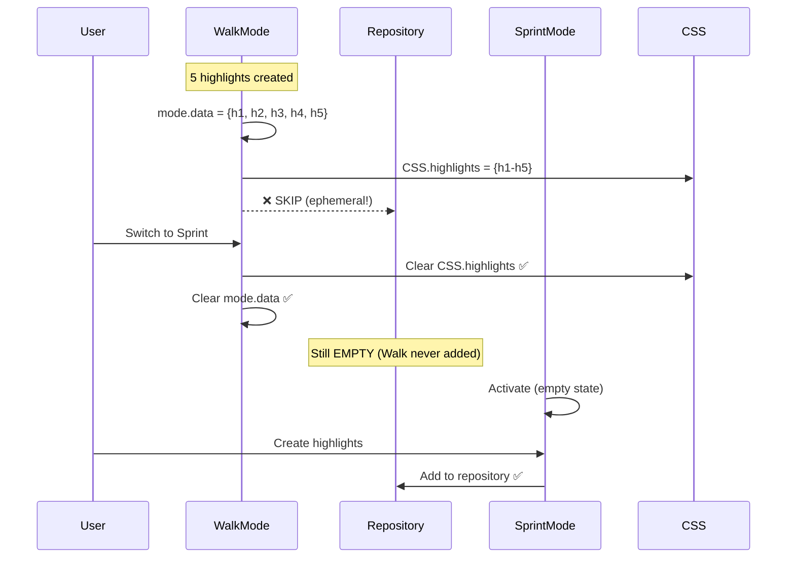
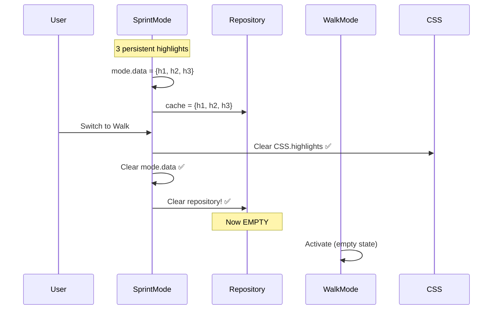
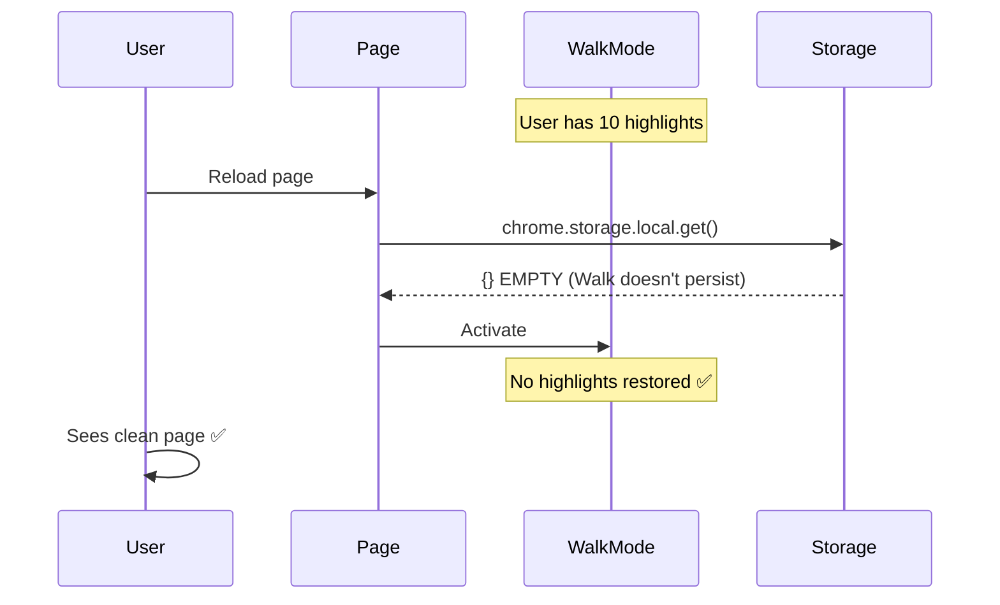

# Mode Switching Consistency Analysis

## Your Questions (Critical Edge Cases)

### Case 1: Walk Mode (with highlights) → Sprint Mode

**Current Behavior**:

```typescript
// Walk Mode has 5 highlights
user clicks "Switch to Sprint Mode"
  ↓
WalkMode.onDeactivate() called
  ↓
for (const id of this.highlights.keys()) {
  await this.removeHighlight(id); // Removes from CSS, mode.data
}
  ↓
Repository still has Walk Mode highlights! ❌
  ↓
Sprint Mode activates with empty mode.data
  ↓
User creates Sprint highlights
  ↓
Repository now has MIXED: Walk + Sprint highlights ❌
```

**Problem**: Walk Mode writes to repository but doesn't clean it up on
deactivate!

---

### Case 2: Sprint Mode (with highlights) → Walk Mode

**Current Behavior**:

```typescript
// Sprint Mode has 3 highlights (saved to repository)
user switches to Walk Mode
  ↓
SprintMode.onDeactivate() called
  ↓
for (const id of this.highlights.keys()) {
  await this.removeHighlight(id); // Clears CSS, mode.data
}
  ↓
Repository STILL has Sprint highlights! ❌
  ↓
Walk Mode activates
  ↓
Hover detector reads repository → finds Sprint highlights ❌
  ↓
User sees delete icons for invisible highlights! ❌
```

**Problem**: Deactivate clears visual highlights but not repository!

---

### Case 3: Walk Mode Privacy (Reload)

**Expected**: Walk Mode is ephemeral, nothing persists

**Current Code** (walk-mode.ts:112):

```typescript
// 4. Add to Repository (Memory Only)
// In Walk Mode, 'repository' is purely ephemeral.
await this.repository.add(data as any); // ❌ WRITES TO REPO!
```

**Problem**: Walk Mode writes to repository, violating ephemeral contract!

---

## The REAL Architecture Issues

### Issue #1: Repository is NOT Mode-Aware

```typescript
// Repository has NO CONCEPT of which mode owns which highlight!
repository.cache = Map<id, HighlightData>;

// When modes switch:
// - Old mode clears its mode.data ✅
// - Old mode clears CSS.highlights ✅
// - Repository.cache? Still has old data ❌
```

### Issue #2: Walk Mode Violates Ephemeral Contract

**Walk Mode SHOULD**:

- ✅ Not persist to chrome.storage
- ❌ **Should NOT write to repository** (currently DOES!)

**Current Walk Mode** (line 112):

```typescript
await this.repository.add(data as any); // ❌ BAD!
```

---

## What SHOULD Happen (Correct Behavior)

### Scenario 1: Walk Mode → Sprint Mode



**Result**: ✅ Clean switch, no contamination

---

### Scenario 2: Sprint Mode → Walk Mode



**Result**: ✅ Repository cleared, Walk starts fresh

---

### Scenario 3: Walk Mode Reload



**Result**: ✅ True ephemeral mode

---

## The Fix Required

### Fix #1: Make Walk Mode Truly Ephemeral

```typescript
// walk-mode.ts
async createHighlight(selection: Selection, colorRole: string) {
  // ... create highlight ...

  // ✅ Add to mode state
  this.highlights.set(id, highlight);
  this.data.set(id, data);

  // ❌ REMOVE THIS:
  // await this.repository.add(data);

  // ✅ Walk Mode = CSS only, no repository!
}
```

### Fix #2: Clear Repository on Mode Switch

```typescript
// base-highlight-mode.ts
async onDeactivate() {
  this.logger.info(`${this.name} mode deactivated`);

  // 1. Clear visual highlights
  for (const id of this.highlights.keys()) {
    await this.removeHighlight(id);
  }

  // 2. Clear repository (if mode had persistence)
  if (this.shouldPersist()) {
    for (const id of this.data.keys()) {
      await this.repository.remove(id); // ✅ ADD THIS
    }
  }
}
```

### Fix #3: Ensure Sprint/Vault Sync to Repository

```typescript
// sprint-mode.ts, vault-mode.ts
async createFromData(data: HighlightData) {
  // ... create highlight ...

  this.data.set(data.id, data);

  // ✅ ALWAYS sync to repository
  await this.repository.add(data);

  this.eventBus.emit(HIGHLIGHT_CREATED);
}
```

---

## Proposed Architecture

### Mode-Aware Repository

```typescript
interface RepositoryEntry {
  data: HighlightData;
  mode: 'walk' | 'sprint' | 'vault'; // ✅ Track which mode owns it
}

class RepositoryFacade {
  private cache = new Map<string, RepositoryEntry>();

  add(highlight: HighlightData, mode: string) {
    this.cache.set(highlight.id, { data: highlight, mode });
  }

  clearMode(mode: string) {
    // Clear all highlights from specific mode
    for (const [id, entry] of this.cache.entries()) {
      if (entry.mode === mode) {
        this.cache.delete(id);
      }
    }
  }
}
```

---

## Summary: What Needs Fixing

| Issue                      | Current | Should Be | Fix                                                                                                                                      |
| -------------------------- | ------- | --------- | ---------------------------------------------------------------------------------------------------------------------------------------- |
| **Walk writes to repo**    | ❌ YES  | ❌ NO     | Remove `repository.add()` from Walk                                                                                                      |
| **Repo cleared on switch** | ❌ NO   | ✅ YES    | Add `repository.clearMode()` to [onDeactivate()](file:///home/sandy/projects/_underscore/src/content/modes/base-highlight-mode.ts#51-58) |
| **Sprint syncs to repo**   | ❌ NO   | ✅ YES    | Add `repository.add()` to [createFromData()](file:///home/sandy/projects/_underscore/src/content/modes/sprint-mode.ts#146-161)           |
| **Walk reload restores**   | ✅ NO   | ✅ NO     | Already correct                                                                                                                          |

---

## Answers to Your Questions

### Q1: Walk Mode → Sprint Mode consistency?

**Current**: ❌ Broken - Walk highlights stay in repository  
**Fixed**: ✅ Walk never writes to repository, clean switch

### Q2: Proper sync between mode and repository?

**Current**: ❌ Broken - modes deactivate but don't clear repository  
**Fixed**: ✅
[onDeactivate()](file:///home/sandy/projects/_underscore/src/content/modes/base-highlight-mode.ts#51-58)
clears repository for that mode

### Q3: Walk Mode doesn't use repository/persistence?

**Current**: ❌ Broken - Walk Mode DOES write to repository (line 112)  
**Fixed**: ✅ Walk Mode skips repository entirely

---

## Implementation Plan

1. **Remove repository.add() from Walk Mode** (1 line delete)
2. **Add repository.clearMode() to onDeactivate()** (3 lines)
3. **Add repository.add() to Sprint/Vault createFromData()** (1 line)
4. **Test all 3 scenarios**

Should I implement these fixes now?
