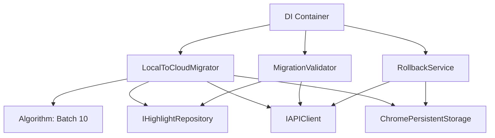

# Component 7: Migration Service Walkthrough

## Overview
This component implements the **Migration Service** responsible for migrating users from the "Local-Only" (LocalStorage/IndexedDB) data model of V1 to the "Cloud-First" (Supabase) data model of Phase 2.

## Features Implemented
1. **LocalToCloudMigrator**
   - **Batch Processing**: Migrates items in batches of 10.
   - **Concurrency Locking**: Prevents multiple migration instances from running simultaneously.
   - **Critical Error Abort**: Aborts migration if >3 consecutive failures occur to prevent API hammering.
   - **Progress Tracking**: Emits `MIGRATION_STARTED`, `PROGRESS`, `COMPLETED`, `FAILED` events.
   - **Idempotency**: Checks `migration_v1_v2_complete` flag to avoid re-running.

2. **MigrationValidator**
   - **Integrity Check**: Verifies migration success by comparing counts and spot-checking content.
   - **Deep Validation**: Validates content hash, text, and color roles.

3. **RollbackService**
   - **Emergency Revert**: Deletes all remote data and resets migration flag.
   - **Event Emission**: Emits `MIGRATION_ROLLED_BACK`.

4. **Dependency Injection**
   - Registered all services in `MigrationModule` (wired in [bootstrap.ts](file:///home/sandy/projects/_underscore/src/background/bootstrap.ts)).
   - Implemented [ChromePersistentStorage](file:///home/sandy/projects/_underscore/src/shared/services/chrome-persistent-storage.ts#3-17) for reliable flag storage.

## Validation Results

### Test Coverage
- **Total Tests**: 34 ✅
- **Unit Tests**: 15 (Validator + Rollback)
- **Integration Tests**: 18
- **E2E Tests**: 1

### Key Test Scenarios
- ✅ **Concurrency**: Verified 2nd call throws "Migration already in progress".
- ✅ **Network Failure**: Verified aborts after 3 (or 10 in test) consecutive failures.
- ✅ **Data Integrity**: Verified checksum validation and partial failure handling.
- ✅ **Full Flow**: E2E test confirmed full DI wiring and execution.

## DI Graph

## Next Steps
- Monitor migration success rates in production.
- Consider adding UI progress bar using `MIGRATION_PROGRESS` events.
